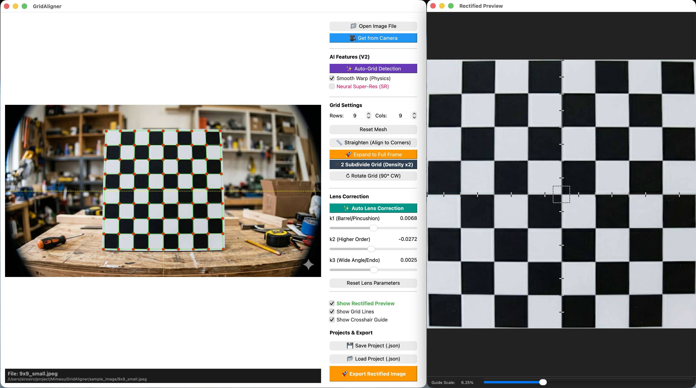

# GridAligner

直感的なメッシュ操作と AI 自動検出を融合させた、次世代の画像幾何学歪み補正ツール。



---

## 概要

**GridAligner** は、魚眼レンズや超広角レンズ特有の放射状歪み（レンズ歪み）や、撮影角度によるパースの歪みを、誰でも簡単に、かつ極めて正確に補正するために設計されたデスクトップアプリケーションです。

従来の数値入力中心のツールとは異なり、画像の上に重ねられた「格子（グリッド）」を直接マウスで操作する直感的なインターフェースと、PyTorch ベースの強力な AI 検出エンジンを搭載しています。

---

## 主な機能

### 1. ハイブリッド・レンズ補正 (Lens Correction)
*   **物理モデルベース**: OpenCV の円形歪みモデルを採用し、k1/k2 係数をスライダーでリアルタイム調整。
*   **Intelligent Sync**: レンズの歪み具合を変えても、設定済みのグリッドが画像内の交点を自動で追いかけ、ズレを防ぎます。
*   **高度なレンズモデル**: $k1, k2$ に加え、$k3$（6次歪み）をサポート。内視鏡や魚眼レンズなどの極端な歪みも正確に補正可能です。
*   **バレル・ピンクッション対応**: 樽型から糸巻き型まで、あらゆるレンズ特性に対応。

### 2. インテリジェント・メッシュ補正 (Mesh Rectification)
*   **自由なメッシュ変形**: コントロールポイントをドラッグするだけで、局所的な歪みをピンポイントで補正。
*   **Smooth Warp (物理演算)**: 物理学ベースのエネルギー最小化アルゴリズムにより、数点を動かすだけで周囲のメッシュが滑らかに追従し、格子の連続性を維持します。
*   **非破壊的な四隅調整**: ドラッグ操作時に既に追い込んだメッシュの「歪み形状」を維持したまま、全体をパース変形させることが可能です。
*   **メッシュ倍密化 (Subdivide)**: 格子構造を維持したまま密度を 2 倍に増加させ、より微細な幾何補正を支援します。

### 3. AI 格子自動検出 (Auto-Grid Detection V2)
*   **ハイブリッドエンジン**: チェッカーボード認識と投影プロファイル解析を統合。
*   **サブピクセル精度**: 1ピクセル以下の精度で格子点を自動検出し、手動操作の手間を大幅に削減します。
*   **色依存なし**: あらゆる背景や照明条件下での安定した検出を実現。

### 4. アドバンスド・グリッド・ユーティリティ
*   **Grid Straighten**: 四隅を基準に、歪んだ格子を幾何学的に正しい直線上へ一括整列。
*   **Grid Extrapolation**: 小さなボード一枚から、画像全体へのパース適用を実現。
*   **Real-time Preview**: PyTorch の `grid_sample` を活用した、CPU 負荷の低い高品質なリアルタイムプレビュー窓。
*   **高精度ビジュアルガイド**: 0.01% 刻みの精密スライダーと、あらゆる背景で視認可能な XOR (Difference) 描画モードを統合。

---

## テクノロジー

*   **GUI Framework**: [PySide6 (Qt for Python)](https://www.qt.io/qt-for-python)
*   **Computer Vision**: [OpenCV](https://opencv.org/)
*   **Deep Learning / Ops**: [PyTorch](https://pytorch.org/)

---

## インストールと実行

### 前提条件
*   Python 3.9 以上
*   pip

### 手順
```bash
# 依存ライブラリのインストール
pip install -r requirements.txt

# アプリケーションの起動
python src/main.py
```

---

## 開発ドキュメント

詳細な仕様やアーキテクチャについては、`docs` ディレクトリ内のドキュメントを参照してください。

*   [基本仕様書](docs/spec/spec.md)
*   [アーキテクチャ・マニフェスト](ARCHITECTURE_MANIFEST.md)
*   [ドキュメント・インデックス](docs/README.md)

---

## 開発について

本プロジェクトは **Mimasu Project** の一環として開発されています。
AI と人間の共創（Pair Programming）により、幾何学計算の厳密さと直感的なユーザー体験の両立を目指しています。

---

## ライセンス

[MIT License](LICENSE)
