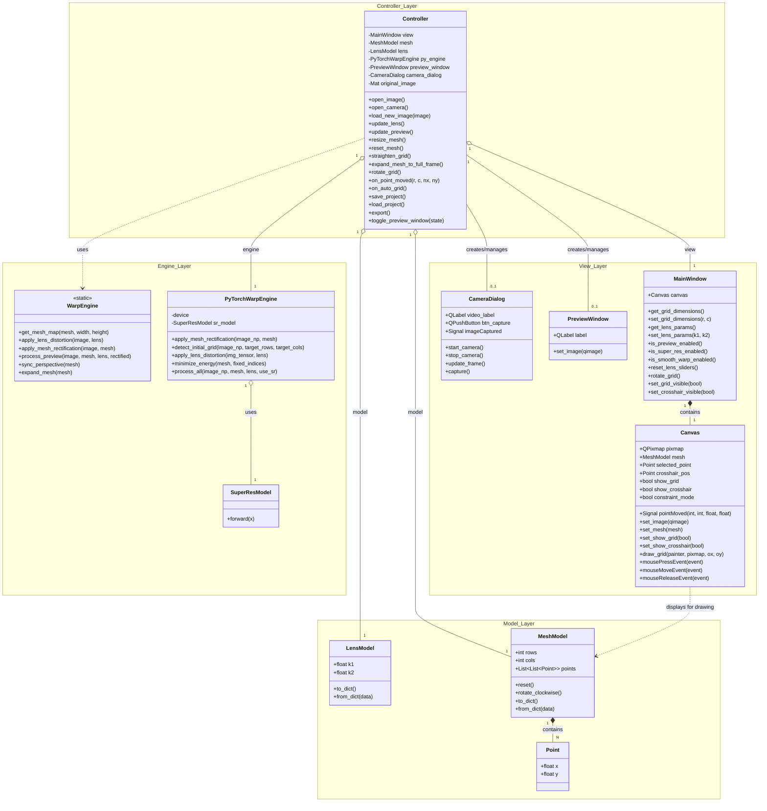

# GridAligner 開発仕様書 (v1.2.1)

## 1. プロジェクト概要
**GridAligner** は、魚眼レンズや超広角レンズによる幾何学的な画像歪み（レンズ歪み・パース歪み）を、直感的な GUI 操作と AI 自動検出によって補正するためのデスクトップアプリケーションである。

> [!NOTE]
> 格子の自動検出は、**チェッカーボード（市松模様）等のテストパターン**、およびコントラストの明確な人工的な格子を主な対象とする。自然風景や一般的な建造物内の複雑な格子検出は、手動操作（コントロールポイントのドラッグ）による補正を前提とする。

## 2. コア機能

### 2.1 レンズ歪み補正 (Lens Correction)
* OpenCV の円形歪みモデルをベースとした補正エンジン。
* **k1 (第2次係数)**, **k2 (第4次係数)** のスライダー操作によるリアルタイム補正。
* バレル（樽型）およびピンクッション（糸巻き型）の両方に対応。

### 2.2 メッシュ・レクティファイ (Mesh Rectification)
* 自由度の高い格子状メッシュによる局所的な歪み（パース・台形歪み）の補正。
* コントロールポイント（赤丸）をマウスでドラッグし、画像内の格子線に合わせることで直線を復元。
* **Smooth Warp (Physics)**: 物理演算ベースのエネルギー最小化により、数点の補正から周辺のメッシュを滑らかに追従させ、格子の連続性を維持する。

### 2.3 AI 格子自動検出 (Auto-Grid Detection V2 - Hybrid Engine)
**チェッカーボード認識**と**投影プロファイル解析**を統合したハイブリッドエンジンを採用。

*   **ハフ変換を除外した理由 (Technical Rationale)**:
    *   **ノイズへの脆弱性**: エッジの断片やノイズに対しても「線」として検出してしまうため、格子線以外の不要な検出（偽陽性）が多く、その後のフィルタリングが高コストになる。
    *   **構造復元の困難さ**: 検出されるのはあくまでバラバラな「直線」であり、それらを統合して一つの「格子構造（メッシュ）」として再構成する際に、高度な幾何学的グルーピング処理が必要で、計算ミスが起きやすい。
    *   **パラメータ依存**: 画像の明るさやコントラストの変化に対し、適切な二値化しきい値の調整が難しく、汎用性に欠ける。

*   **ハイブリッド方式を採用したメリット**:
    *   **チェッカーボード認識**: 数学的に定義されたパターンを直接探すため、パースのついた画像でも交点を数ピクセル以下の精度で一括特定できる。
    *   **投影プロファイル解析 (Fallback)**: 個々の線を追うのではなく、画像全体のエッジ密度（プロファイル）をヒストグラム化して解析する。これにより、一部の線が途切れていたりノイズが混じっていたりしても、格子全体の「周期性」から安定してライン位置を導き出せる。

*   **ハイブリッド認識の構成**:
    *   **チェッカーボード・フィッティング**: `cv2.findChessboardCornersSB` 等を用いて幾何学的パターンを高速・高精度に認識。設定値（Rows/Cols）の自動補完機能を備え、キャリブレーション精度を極限まで高める。
    *   **投影プロファイル解析 (Fallback)**: エッジ密度解析による統計的ピーク判定により、非定型の格子模様にも対応。
    *   **色依存なし (Color-Agnostic)**: RGB 各チャンネルからエッジを抽出・合成。
    *   **コーナー・サブピクセル吸着**: `cv2.cornerSubPix` により 1ピクセル以下の精度で交点にスナップ。

*   **格子検出の精度向上の方針**:
    *   **うねりの解消**: 現在の `SB (Sector Based)` 方式とサブピクセル吸着により、一般的な角度の付いたボードについては十分な精度（許容範囲）で検出可能である。
    *   **再検討のトリガー**: 将来的に、極限まで「うねり」を排除した超高精度な幾何補正が要求される場合には、Meta（旧Facebook）が提唱する Deltille Grids 系のコーナー最適化アルゴリズム等の導入を再検討する。
    *   **参考記事**: [facebook（現Meta）のキャリブレーションパターン検出器の精度はOpenCV実装よりも高い](https://qiita.com/fukushima1981/items/0e0f2a56b115d3271ebf)
    *   **GitHub**: [Deltille Detector](https://github.com/deltille/detector)

*   **利便性向上の方針 (Upcoming)**:
    *   **[AI格子サイズ推定](../research/auto_count_by_AI.md)**: 現在はユーザーが `Rows/Cols`（マスの数）を入力する必要があるが、PyTorch を用いて画像から直接格子点数をカウントし、UIへ自動設定する機能を実装予定。
    *   **[レンズ補正値の自動推定](../research/auto_lens_correction_by_AI.md)**: ハフ変換等を用いて画像内の「直線の真っ直ぐさ」を数学的に評価し、最適なレンズ歪み係数（k1, k2）をAIが自動で微調整する機能。
    *   **[外部連携用メタデータの書き出し](../research/export_metadata_for_FFmpeg.md)**: FFmpeg の `lenscorrection` フィルタで使えるコマンド引数の自動生成や、`remap` フィルタ、OpenCV 等で利用可能なマップファイル（LUT）の書き出し機能。これにより、調整したレシピを大容量動画やリアルタイム配信へ適用可能にする。

### 2.4 格子整列機能 (Grid Straighten / Align to Corners)
物理的な要因（印刷した紙のしなり等）による不要な歪みを排除するための機能。

*   **目的**: キャリブレーションシート自体が平面でない場合、AIがその「物理的なうねり」まで忠実に検出してしまい、補正結果に不要な歪みが残ることがある（物理的な歪みを補正画像へ再現してしまう）。本機能は、これを数学的にキャンセルし、理想的な幾何学平面を復元することを目的とする。
*   **仕組み**: 
    1.  現在のメッシュの四隅の角（Top-Left, Top-Right, Bottom-Left, Bottom-Right）を基準点とする。
    2.  4点を結ぶ射影変換（ホモグラフィ）を再計算する。
    3.  内部のすべての交点を、その射影変換に基づいた「幾何学的に正しい直線上」へ強制的に再配置する。
*   **ワークフローでの役割**: AI自動検出（Auto-Grid Detection）によって得られたガタつきのあるメッシュに対し、四隅のみを正しい位置へ微調整した後に実行することで、ワンクリックで全体の整合性を整えることができる。

### 2.5 格子外挿機能 (Grid Extrapolation / Expand to Full Frame)
一部の領域（チェッカーボード等）から得られたパース情報を画像全体へ拡張する機能。

*   **目的**: 物理的な制約で「画角いっぱいの巨大な格子」を用意できない場合でも、壁に貼った小さなボード一枚を AI 検出するだけで、その平面（パース）を画像全体に適用し、画面全体の垂直・水平を正すことができる。
*   **用途**: 広角レンズでの室内撮影や、特定平面（壁、床）の正対化補正。
*   **仕組み**: 
    1.  現在の部分的なメッシュから、その平面の射影変換行列（ホモグラフィ）を算出。
    2.  画像全体の四隅（(0,0)〜(1,1)）が、その平面の一部であると仮定した場合の「歪み画像内での座標」を逆算（外挿）。
    3.  メッシュの四隅を算出した座標まで弾き飛ばし、全体の格子を再整列する。
*   **設計方針**: `WarpEngine` クラスにパース行列の逆演算ロジックを実装し、Controller を介して UI から実行可能にする。

### 2.6 格子向き補正機能 (Grid Orientation Correction)
AI（OpenCV等）が格子の「左上」を誤認した場合に、格子の向きを90度単位で修正する機能。

*   **目的**: AIは格子の形状を認識できても、物理的な「上」がどこかを判別できないことがある。そのまま外部ツール（FFmpeg等）へデータを出力すると、映像が上下逆さまに変換される等の不整合が発生するため、出力前に手動かつ一括で向きを正す。
*   **動作**:
    1.  格子のポイント配列を時計回りに90度回転させる。
    2.  長方形格子の場合は、`Rows`（行数）と `Cols`（列数）の数値を自動的にスワップ（入れ替え）し、内部グリッドを再構築する。
*   **重要性**: FFmpeg の `remap` フィルターや `lenscorrection` 等へメタデータを渡す際、座標の起点を定義どおり（動画の左上）に揃えるために必須の工程となる。

### 2.7 描画補助機能 (Visual Aids: Grid & Crosshair)
レンズ歪みの微調整を容易にするため、表示モードを切り替える機能。

*   **Grid Mode**: 格子全体を表示。メッシュ変形や全体的なパース確認に適している。
*   **Crosshair Mode**: マウスクリックした地点を通る「水平・垂直の十字ガイド」のみを表示。画像内の特定のライン（水平線、柱のエッジ等）が、補正によって完全に真っ直ぐになったかどうかを「バーチャル定規」のように確認するのに適している。
*   **目的**: 全面の格子表示が画像細部の視認性を損なう場合でも、最小限のガイドラインで高精度な歪み補正を実現する。

## 3. ワークフローとパイプライン
本アプリは以下の高度に同期された画像処理パイプラインを持つ。

1.  **レンズ補正先行フロー**: ユーザーがスライダーで大まかなレンズ歪みを取った後の「真っすぐになった画像」を AI 検出エンジンへ入力。これにより、AI は複雑な曲線ではなく「単純な直線」を探すだけで済み、検出精度が劇的に向上。
2.  **PyTorch 高速プレビュー**: メイン画面の編集結果をリアルタイムで反映する別ウィンドウ（Rectified Preview）。PyTorch の Tensor 演算（`grid_sample`）により、CPU に負荷をかけず高品質な補正結果を表示。
3.  **レンズ・エンジン同期**: OpenCV（メイン）と PyTorch（プレビュー）の歪み計算モデルを厳密に同期。スライダーの値による補正結果が両方のビューで 100% 一致する。

## 4. 設計方針とアーキテクチャ
本アプリは、将来的な機能拡張と **AIによる効率的なコード管理** を容易にするため、以下の設計方針を採用している。

*   **疎結合なMVCパターン**: 
    *   **Model**: 単純なデータ構造（dataclass）とし、幾何計算やUIロジックを持たない。
    *   **View**: 表示と入出力に特化。ウィジェットの内部構造を隠蔽する抽象化メソッド（ゲッター/セッター）を提供し、Controllerとの結合を最小化する。
    *   **Controller**: Viewのシグナルを購読し、Modelを更新後、Engineを使って処理結果をViewへ戻す仲介役。
*   **変更の局所化**: 
    *   Viewでマウス操作が行われても、View自体はModelを書き換えず、座標データをシグナルとしてパブリッシュするのみとする。これにより、画像処理ロジックの変更がUIの実装に影響を与えない。
*   **AI管理の適正化**: 
    *   各クラスの責務が局所化されているため、AIアシスタントがコードのコンテキストを把握しやすく、バグの混入を防ぎながら迅速な機能追加が可能となる。
*   **ハイブリッド・プロセッシング・エンジンの採用**:
    *   **OpenCV（標準エンジン）**: 軽量なCPU処理を主体とし、メイン画面での標準的な歪み補正表示を担当。AIライブラリに依存しない高いポータビリティと、低スペックPCでの安定動作を保証する。
    *   **PyTorch（拡張エンジン）**: GPU/並列演算を活用し、プレビュー窓でのリアルタイム補正や超解像、物理演算最適化を担当。重い処理を別エンジンに切り出すことで、メイン操作（ドラッグ等）の軽快さを損なわずに高度なAI機能を提供できる。

## 5. クラス図
各レイヤーの役割：
- **Model層**: アプリケーションの状態を保持する純粋なデータコンテナ（dataclass）。ビジネスロジックやUI依存を持たず、シリアライズ（JSON化）が容易な構造。
  - **Pointクラス**: 2次元座標（x, y）を保持する最小単位のデータクラス。画像サイズに依存しない正規化された中心座標（0.0 - 1.0）として扱う。
  - **LensModelクラス**: レンズ歪み補正係数（k1, k2）を保持。プロジェクト保存用のシリアライズ（to_dict/from_dict）を備える。
  - **MeshModelクラス**: 格子状メッシュの行数・列数、および全制御点のPointリストを保持。メッシュのリセット機能を担当。
- **View層**: PySide6によるUI構築と描画を担当。`MainWindow`はウィジェットを直接公開せず、抽象化されたインターフェース（ゲッター/セッター）をControllerに提供する。
  - **MainWindowクラス**: アプリのメインウィンドウ。各UIコントロール（スライダー、ボタン等）を配置し、値をControllerが取得・設定するための抽象化メソッドを提供する。
  - **Canvasクラス**: メイン画像と格子メッシュを重畳描画するカスタムウィジェット。マウスによる制御点移動を検知し、正規化座標をSignalとして発行する。
  - **PreviewWindowクラス**: 補正完了後の画像をリアルタイムに確認するための専用ウィンドウ。
  - **CameraDialogクラス**: 接続されたカメラからリアルタイムプレビューを表示し、任意のタイミングで画像をキャプチャしてControllerへ渡す。
- **Controller層**: Viewからの信号（Signal）をハンドリングし、Modelを更新する。Engineを呼び出して画像処理パイプラインを実行し、結果をViewに反映させる「仲介役」。
  - **Controllerクラス**: アプリのライフサイクルとイベントフローを管理。View（入力） -> Model（更新） -> Engine（演算） -> View（表示）の一連の同期を制御し、データの一貫性を保証する。
- **Engine層**: 画像処理、幾何計算、AIによる格子検出、物理演算（エネルギー最小化）などのロジックを実装。状態を持たない（ステートレス）か、Modelを外部から受け取って処理する設計。
  - **WarpEngineクラス**: OpenCVベースの高速な画像変換エンジン。レンズ歪み補正、メッシュによる再投影、4隅に合わせたパース同期（ホモグラフィ）等を静的メソッドで提供。
  - **PyTorchWarpEngineクラス**: GPU/CPU演算を活用した高度な補正エンジン。AIによる格子自動検出（V2）、物理演算ベースのメッシュ最適化（Smooth Warp）等を統括する。
  - **SuperResModelクラス**: PyTorchで実装されたCNNベースの超解像モデル。補正処理によって失われがちな画像の鮮明度をニューラルネットワークで復元する。

## 6. 出力
*   **Rectified Image**: レンズ補正とメッシュ補正が畳み込まれた最終的な直線画像を JPEG/PNG でエクスポート。
*   **Project File**: レンズ係数とメッシュポイントの座標を `.json` 形式で保存・再開可能。