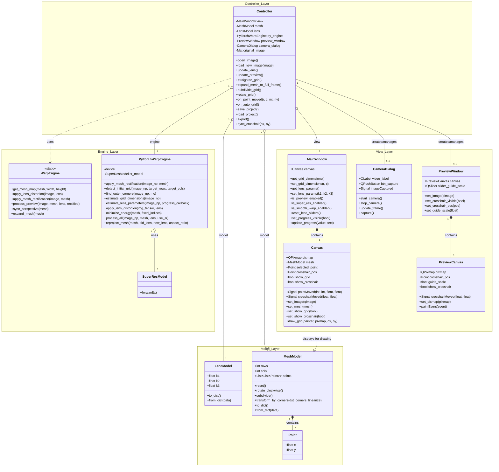

# src/ARCHITECTURE_MANIFEST.md (Implementation Detail)

## Part 1: このマニフェストの取扱説明書 (Guide)

1.  **目的 (Purpose)**: 
    - `src/` 以下のソースコード（Python/PySide6）における、具体的な API 設計、データ構造、およびコンポーネント間の契約（Contract）を定義する。
2.  **憲章の書き方 (Guidelines)**:
    - **API シグネチャの明記**: 引数の意味、型、および所有権（Ownership）を記述する。
    - **ライフサイクルの定義**: オブジェクトがいつ生成され、いつ破棄されるかを明確にする。

---

## Part 2: マニフェスト本体 (Content)

### 1. 核となる原則 (Core Principles)

- **ステートレスな Engine**: Engine 階層の関数は内部状態を持たず、Model を外部から受け取って処理結果を返す（Side-effect free）設計を維持する。
- **UI イベントの正規化**: View (Canvas) から Controller へ送られる座標は、常にスクリーン座標ではなく画像相対の正規化座標 (0.0-1.0) である。
- **物理座標一貫性の原則 (Physical Coordinate Consistency)**: 
    - メッシュの各点は、レンズ歪みの有無に関わらず、元の画像内の同じ物理的特徴（チェッカーボードの交点等）を指し続けるべきである。
    - レンズパラメータ ($k1, k2, k3$) が変更された場合、Controller は Engine を用いてメッシュの正規化座標を再投影し、画像内の物理的な位置を維持しなければならない。
- **非同期処理の安全性 (Asynchronous Safety)**:
    - 自動レンズ補正などの重い演算は、UI スレッドをブロックしないよう非同期（Worker）で実行し、排他制御（演算中の重複リクエスト禁止）を徹底する。
- **非破壊変形 (Non-destructive Transformation)**:
    - グリッドの四隅を調整する際、既存のメッシュの「歪み（曲線形状）」を可能な限り維持したままパース変形（Homography）を行うことで、ユーザーの調整作業を保護する。

### 4. コンポーネント設計仕様 (Component Design Specifications)

#### 4.1. クラス構造概略 (Class Diagram)

#### 4.2. 各クラスの役割詳細 (Component Roles)

##### Model レイヤー (`model.py`)
- **Point**: 2次元座標（x, y）を保持する minimum 単位のデータクラス。画像サイズに依存しない正規化された中心座標（0.0 - 1.0）として扱う。
- **LensModel**: レンズ歪み補正係数（k1, k2, k3）を保持。k3 は内視鏡等の高次放射歪みに対応。プロジェクト保存用のシリアライズ（to_dict/from_dict）を備える。
- **MeshModel**: 
    - 格子状メッシュの行数・列数、および全制御点の Point リストを保持。
    - **subdivide()**: 既存の格子構造を維持したまま、制御点の密度を倍増（x2）させ、幾何学的な補正精度を向上させる。
    - **transform_by_corners(dst_corners, linearize)**: 
        - `linearize=True`: 四隅に合わせて内部を完璧な直線格子にリセットする（Straighten 用）。
        - `linearize=False`: 現在の歪み（曲線形状）を維持したまま全体をパース変形させる（手動調整用）。

##### Engine レイヤー (`engine.py`, `pytorch_engine.py`)
- **WarpEngine**: OpenCV ベースの高速画像変換エンジン。ホモグラフィ同期や低解像度グリッドからのマップ生成を担当。
- **PyTorchWarpEngine**: GPU/並列演算を活用した高度なエンジン。AI 格子検出、物理演算ベースのメッシュ最適化を統括。
- **find_outer_corners(image_np, target_rows, target_cols)**: OpenCV の検出器を用い、指定されたパターンサイズのチェッカーボードを探索し、その 4 隅の座標を返す。
- **reproject_mesh(...)**: 
    - **機能**: レンズ補正状態の変化に合わせて、メッシュの各点を物理的な位置が維持されるように再計算する。
    - **アルゴリズム**: 各点を一度「歪み空間」に逆投影し、ニュートン法を用いて新しいレンズパラメータに基づいた「新補正空間」へ再投影する。
- **estimate_grid_dimensions(image_np)**: 画像のエッジ投影プロファイルを解析し、格子点数（rows, cols）を自律的に推定する。
- **estimate_lens_parameters(image_np, progress_callback)**: 
    - **保守的最適化ポリシー**: 画像内の支配的なエッジをサンプリングし、物理的な面積保存制約を最優先しつつ、直線性が最大化される $k1, k2, k3$ を探索する。
    - **安全装置**: 推定値の暴走を防ぐため、勾配降下法の学習率を抑制し、強い形状維持ペナルティを課す。
- **SuperResModel**: PyTorch で実装された CNN ベースの超解像モデル。

##### Controller レイヤー (`controller.py`)
- **Controller**: アプリのライフサイクルとイベントフローを管理。View（入力） -> Model（更新） -> Engine（演算） -> View（表示）の一連の同期を制御。
- **update_lens**: レンズスライダーの変更を検知した際、`reproject_mesh` を呼び出してメッシュの物理位置を同期させた後、プレビューを更新する。
- **on_auto_lens_correction**: PyTorch Engine を非同期スレッドで呼び出し、画像内の直線性エネルギーを最小化する $k1, k2, k3$ を探索する。
- **extract_grid_from_filename(path)**: ファイル名に含まれる `8x10` 等のパターンを正規表現で抽出し、初期設定のヒントとして利用する。
- **sync_crosshair(nx, ny)**: メインキャンバスとプレビューキャンバスの間で、十字ガイドの正規化座標を双方向に同期させる。

##### View レイヤー (`view.py`)
- **MainWindow**: 各 UI コントロールの配置と、値を Controller が安全に取得・設定するための抽象化メソッドを提供。
- **Canvas**: メイン画像と格子メッシュを重畳描画。マウス操作による制御点移動を検知。
- **PreviewCanvas**: 補正画像専用の描画コンポーネント。
    - **十字ガイド同期**: メイン画面とリアルタイムに同期。
    - **高精度目盛り描画**: Difference モードを用いてあらゆる背景で視認性を確保し、ピクセルベースの正方形スケールを描画。
- **PreviewWindow**: 
    - 補正完了後の画像をリアルタイムに確認するための専用ウィンドウ。
    - **Guide Scale 調整機能**: 下部に専用のスライダー（0.01% 精度）を備え、ガイド枠のサイズを即座に変更可能。
- **CameraDialog**: 接続されたカメラからリアルタイムプレビューを表示し、任意のタイミングで画像をキャプチャして Controller へ渡す。

### 5. 既知の未解決課題 (Known Open Issues)

<!-- Issue: PyTorch デバイス（CPU/GPU）の動的な切り替えUI, Status: 保留, Rationale: 現在は自動選択。将来的にユーザーが選択できるように拡張予定。 -->
