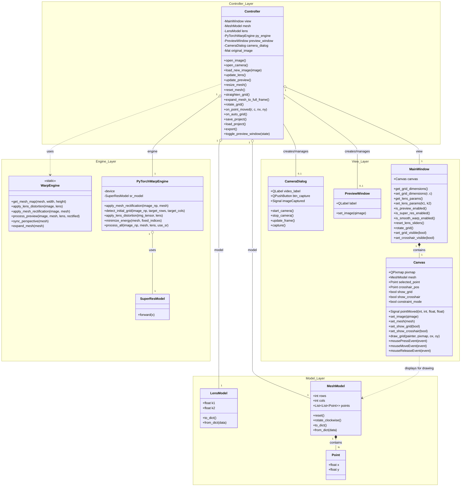

# src/ARCHITECTURE_MANIFEST.md (Implementation Detail)

## Part 1: このマニフェストの取扱説明書 (Guide)

1.  **目的 (Purpose)**: 
    - `src/` 以下のソースコード（Python/PySide6）における、具体的な API 設計、データ構造、およびコンポーネント間の契約（Contract）を定義する。
2.  **憲章の書き方 (Guidelines)**:
    - **API シグネチャの明記**: 引数の意味、型、および所有権（Ownership）を記述する。
    - **ライフサイクルの定義**: オブジェクトがいつ生成され、いつ破棄されるかを明確にする。

---

## Part 2: マニフェスト本体 (Content)

### 1. 核となる原則 (Core Principles)

- **ステートレスな Engine**: Engine 階層の関数は内部状態を持たず、Model を外部から受け取って処理結果を返す（Side-effect free）設計を維持する。
- **UI イベントの正規化**: View (Canvas) から Controller へ送られる座標は、常にスクリーン座標ではなく画像相対の正規化座標 (0.0-1.0) である。

### 4. コンポーネント設計仕様 (Component Design Specifications)

#### 4.1. クラス構造概略 (Class Diagram)

#### 4.2. レイヤー別実装契約

- **Model レイヤー (`model.py`)**: 
    - データの保持とシリアライズ。
- **Engine レイヤー (`engine.py`, `pytorch_engine.py`)**: 
    - ステートレスな幾何変換、AI格子検出、物理演算最適化。
- **Controller レイヤー (`controller.py`)**: 
    - View/Model/Engine の同期。Signal 購読によるライフサイクル管理。
- **View レイヤー (`view.py`)**: 
    - 描画と入力取得。座標の正規化発行。

### 5. 既知の未解決課題 (Known Open Issues)

<!-- Issue: PyTorch デバイス（CPU/GPU）の動的な切り替えUI, Status: 保留, Rationale: 現在は自動選択。将来的にユーザーが選択できるように拡張予定。 -->
